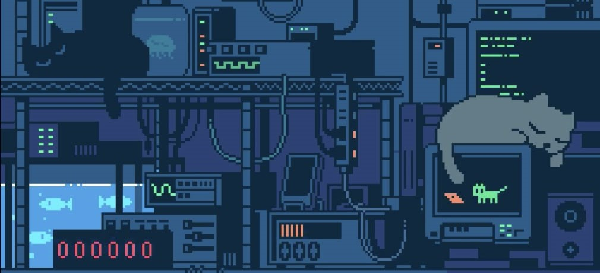

<h1 align="center">Hi 👋 I'm Egor</h1>

Beginner developer exploring web development and Python.  
Building small projects and learning step by step.

---

## 🧠 About me

- 🌱 Learning: Python, Web Development
- 🐧 Linux enthusiast
- 🚀 Building small projects and experimenting
- 🎯 Goal: grow into a confident developer

---

## ⚙️ Tech stack

---

## 📬 Contacts

  
  

   | jedemirus@inbox.ru  
   
   | jedemirus@gmail.com

---

## 💭 Philosophy

> Progress matters more than speed.
